# HW4. SELECT + JOIN

## 1. Выборка всех данных из таблицы

### 1.1. Получить все данные о книгах.

```sql
SELECT * FROM books;
```

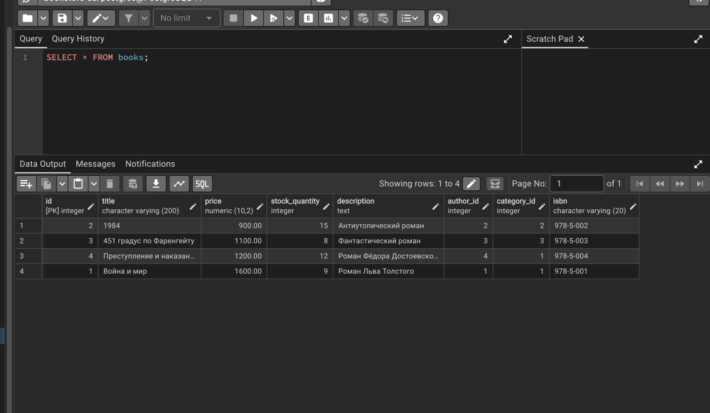

### 1.2. Получить все данные о клиентах.

```sql
SELECT * FROM customers;
```

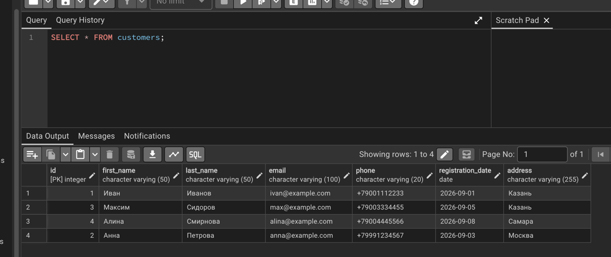


## 2. Выборка отдельных столбцов

### 2.1. Получить названия и цены всех книг.

```sql
SELECT title, price FROM books;
```

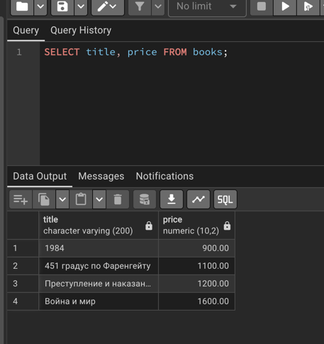


### 2.2. Получить имена, фамилии и страны авторов.

```sql
SELECT first_name, last_name, country FROM authors;
```

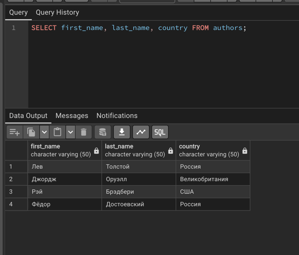


## 3. Присвоение новых имен столбцам

### 3.1. Вывести названия книг и цены с понятными названиями столбцов.

```sql
SELECT title AS book_title, price AS book_price FROM books;
```

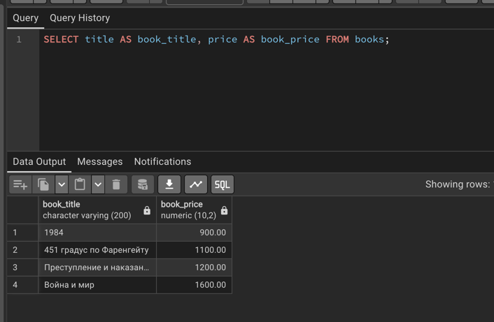


### 3.2. Вывести имена и электронные адреса покупателей, переименовав столбцы.

```sql
SELECT first_name AS customer_name, email AS customer_email FROM customers;
```

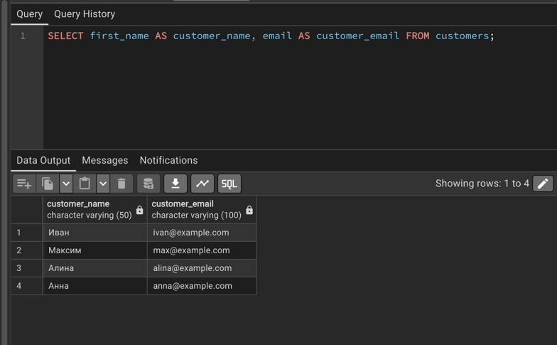


## 4. Выборка с вычисляемым столбцом

### 4.1. Посчитать стоимость всех экземпляров каждой книги на складе.

```sql
SELECT title, price, stock_quantity, price * stock_quantity AS stock_value
FROM books;
```

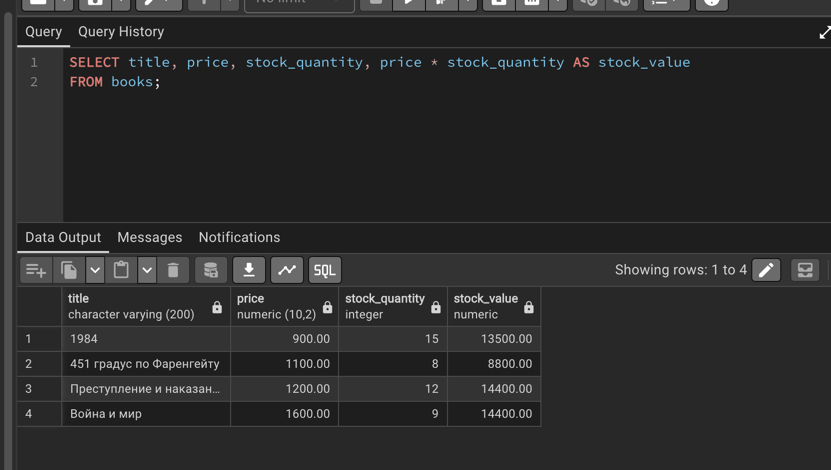


### 4.2. Посчитать стоимость каждой позиции заказа.

```sql
SELECT order_id, book_id, quantity, price, quantity * price AS item_total
FROM order_items;
```

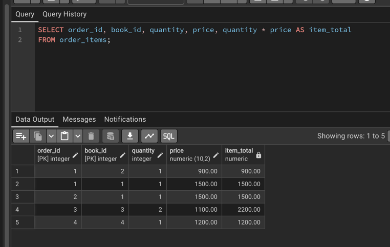


## 5. Вычисляемые столбцы и математические функции

### 5.1. Вывести цену каждой книги с учетом скидки 10%, округлив до двух знаков.

```sql
SELECT title, price, ROUND(price * 0.90, 2) AS discounted_price
FROM books;
```

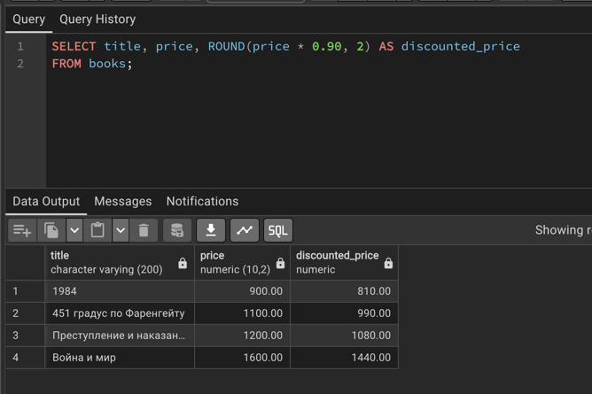


### 5.2. Посчитать цену книги за вычетом 20% НДС, округлив до двух знаков.

```sql
SELECT title, price, ROUND(price / 1.20, 2) AS price_without_vat
FROM books;
```

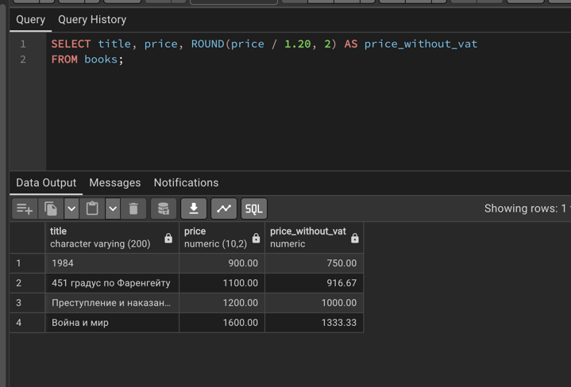


## 6. Вычисляемые столбцы и логические функции (CASE)

### 6.1. Разделить книги на дорогие и недорогие по порогу 1000 рублей.

```sql
SELECT title, price,
       CASE WHEN price > 1000 THEN 'Дорогая' ELSE 'Недорогая' END AS price_group
FROM books;
```

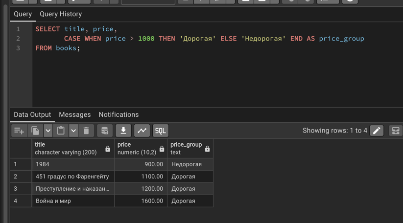


### 6.2. Определить уровень запаса книг: меньше 10 экземпляров — мало, иначе достаточно.

```sql
SELECT title, stock_quantity,
       CASE WHEN stock_quantity < 10 THEN 'Мало' ELSE 'Достаточно' END AS stock_status
FROM books;
```

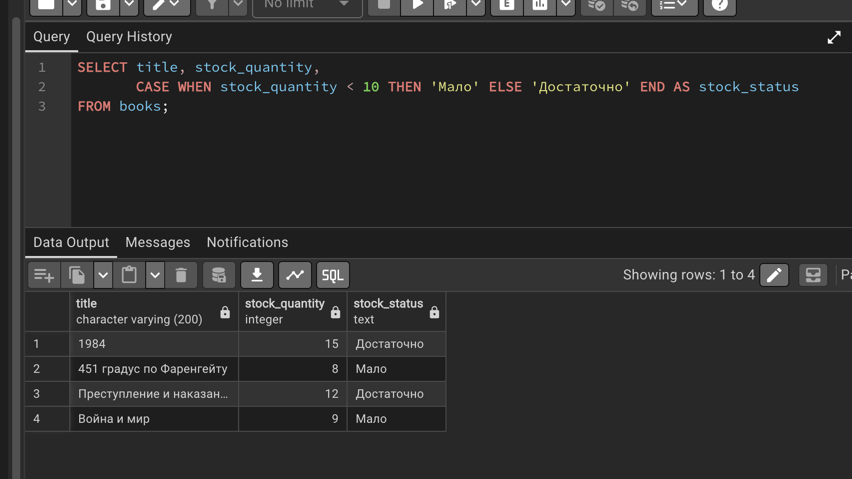


## 7. Выборка данных по условию (WHERE)

### 7.1. Найти книги стоимостью больше 1000 рублей.

```sql
SELECT title, price FROM books WHERE price > 1000;
```

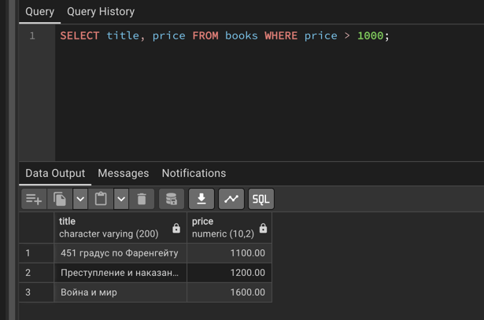


### 7.2. Найти заказы со статусом «Оплачен».

```sql
SELECT id, order_date, total_amount FROM orders WHERE status = 'Оплачен';
```

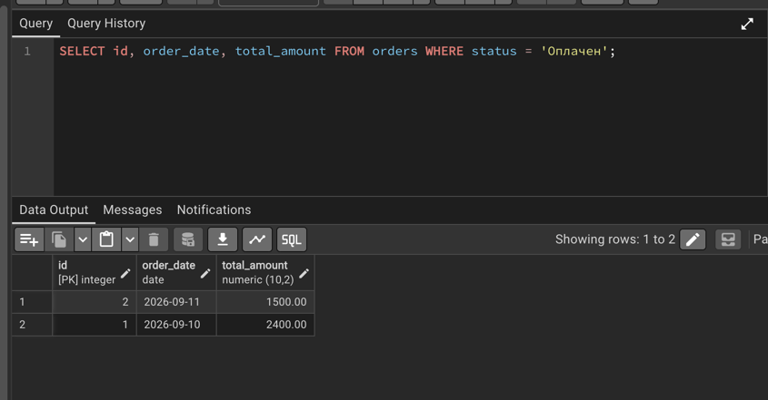


## 8. Выборка данных с логическими операциями

### 8.1. Найти книги дороже 1000 рублей, которых на складе не меньше 10.

```sql
SELECT title, price, stock_quantity
FROM books
WHERE price > 1000 AND stock_quantity >= 10;
```

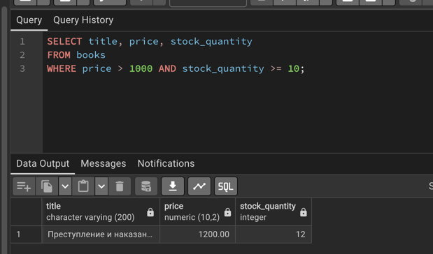


### 8.2. Найти клиентов из Казани или Москвы.

```sql
SELECT first_name, last_name, address
FROM customers
WHERE address = 'Казань' OR address = 'Москва';
```

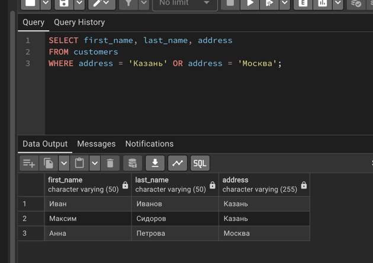


## 9. Выборка данных с BETWEEN и IN

### 9.1. Найти книги по цене от 900 до 1200 рублей включительно.

```sql
SELECT title, price FROM books WHERE price BETWEEN 900 AND 1200;
```

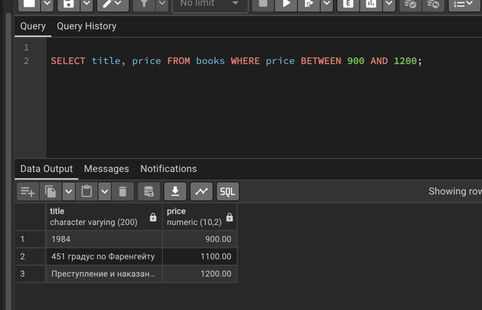


### 9.2. Найти заказы со статусами «Новый» или «Оплачен».

```sql
SELECT id, status, total_amount FROM orders
WHERE status IN ('Новый', 'Оплачен');
```

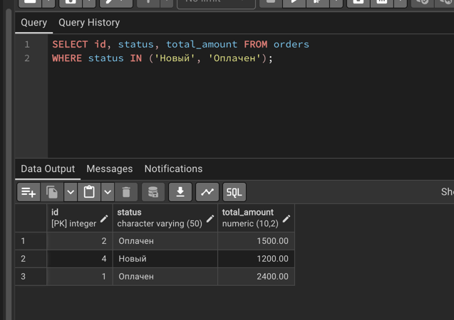


## 10. Выборка данных с сортировкой (ORDER BY)

### 10.1. Отсортировать книги по убыванию цены.

```sql
SELECT title, price FROM books ORDER BY price DESC;
```

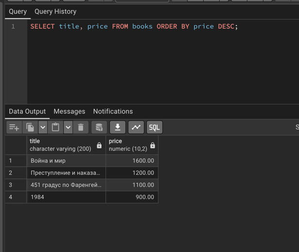


### 10.2. Отсортировать авторов по фамилии, затем по имени.

```sql
SELECT first_name, last_name FROM authors
ORDER BY last_name ASC, first_name ASC;
```

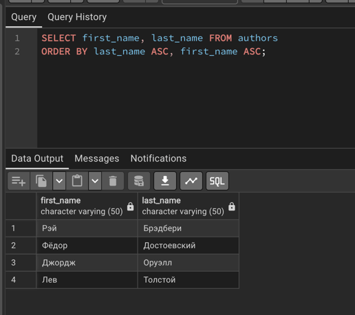


## 11. Выборка данных с LIKE

### 11.1. Найти книги, название которых начинается на «В».

```sql
SELECT title FROM books WHERE title LIKE 'В%';
```

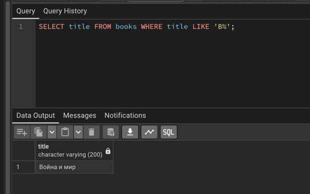


### 11.2. Найти клиентов, у которых почта заканчивается на example.com.

```sql
SELECT first_name, last_name, email FROM customers
WHERE email LIKE '%@example.com';
```

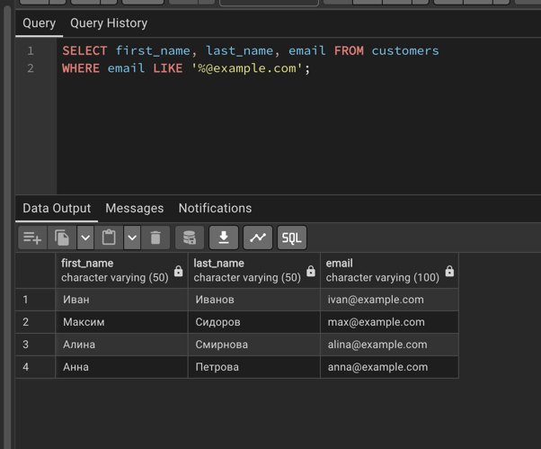


## 12. Выбор уникальных значений (DISTINCT)

### 12.1. Получить уникальные страны авторов.

```sql
SELECT DISTINCT country FROM authors;
```

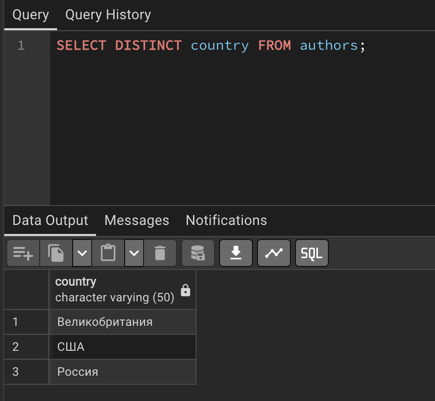


### 12.2. Получить уникальные статусы заказов.

```sql
SELECT DISTINCT status FROM orders;
```

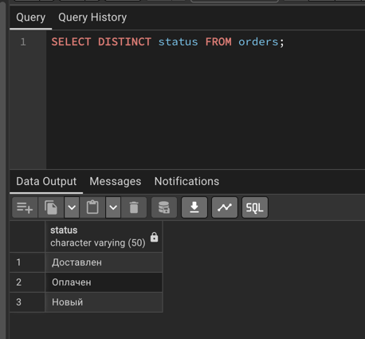


## 13. Ограничение количества строк (LIMIT / OFFSET)

### 13.1. Вывести две самые дорогие книги.

```sql
SELECT title, price FROM books ORDER BY price DESC LIMIT 2;
```

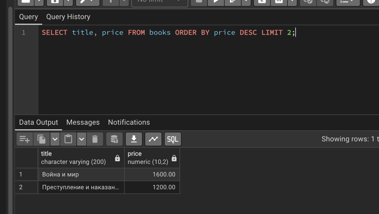


### 13.2. Пропустить первую книгу по алфавиту и вывести следующие две.

```sql
SELECT title, price FROM books ORDER BY title ASC LIMIT 2 OFFSET 1;
```

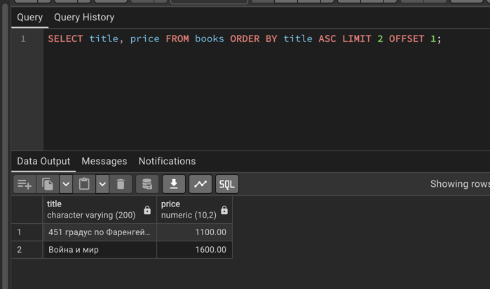


## 14. INNER JOIN

### 14.1. Вывести книги и имена их авторов.

```sql
SELECT b.title, a.first_name, a.last_name
FROM books AS b
INNER JOIN authors AS a ON b.author_id = a.id;
```

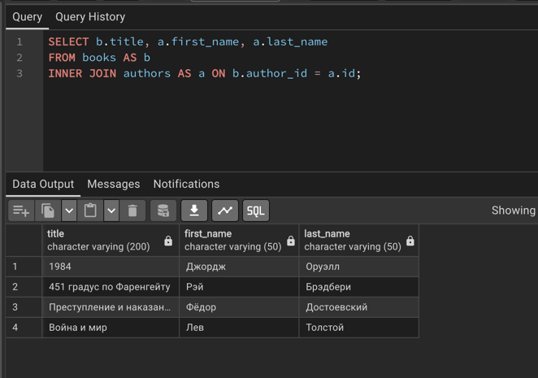


### 14.2. Вывести номера заказов и имена клиентов, которые их оформили.

```sql
SELECT o.id AS order_id, c.first_name, c.last_name
FROM orders AS o
INNER JOIN customers AS c ON o.customer_id = c.id;
```

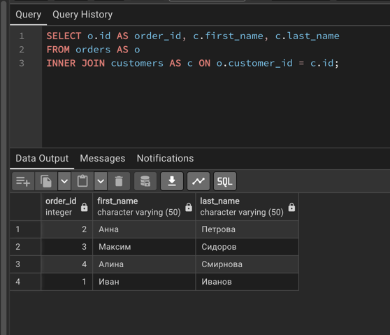


## 15. LEFT JOIN

### 15.1. Вывести все категории и книги, которые к ним относятся (в том числе категории без книг).

```sql
SELECT c.name AS category_name, b.title
FROM categories AS c
LEFT JOIN books AS b ON b.category_id = c.id;
```

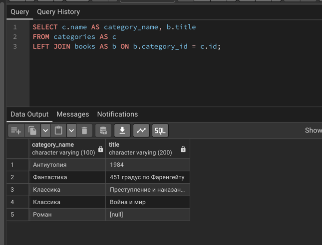


### 15.2. Вывести всех клиентов и номера их заказов (в том числе клиентов без заказов).

```sql
SELECT c.first_name, c.last_name, o.id AS order_id
FROM customers AS c
LEFT JOIN orders AS o ON o.customer_id = c.id;
```

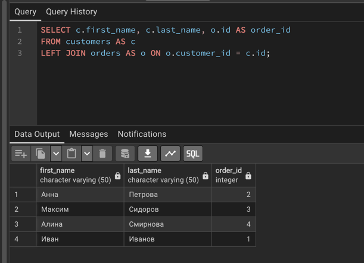


## 16. RIGHT JOIN

### 16.1. Вывести все категории и их книги, включая категории без книг.

```sql
SELECT c.name AS category_name, b.title
FROM books AS b
RIGHT JOIN categories AS c ON b.category_id = c.id;
```

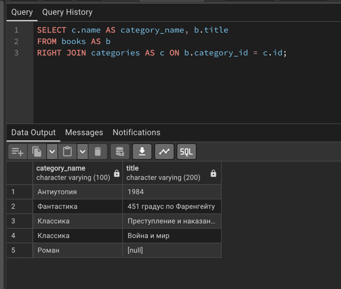


### 16.2. Вывести всех авторов и их книги, включая авторов без книг.

```sql
SELECT a.first_name, a.last_name, b.title
FROM books AS b
RIGHT JOIN authors AS a ON b.author_id = a.id;
```

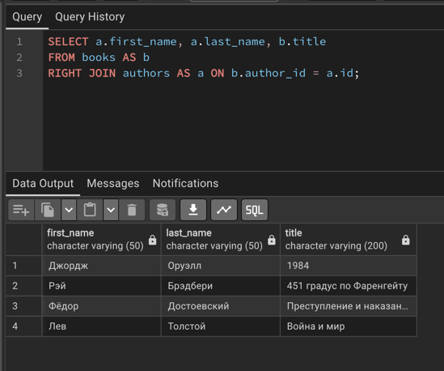


## 17. CROSS JOIN

### 17.1. Получить все возможные пары книг и категорий.

```sql
SELECT b.title, c.name AS category_name
FROM books AS b
CROSS JOIN categories AS c;
```

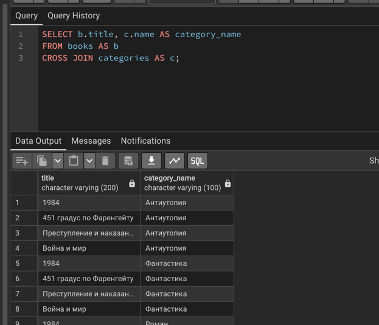


### 17.2. Получить все возможные пары клиентов и статусов из имеющихся заказов.

```sql
SELECT c.first_name, c.last_name, s.status
FROM customers AS c
CROSS JOIN (SELECT DISTINCT status FROM orders) AS s;
```

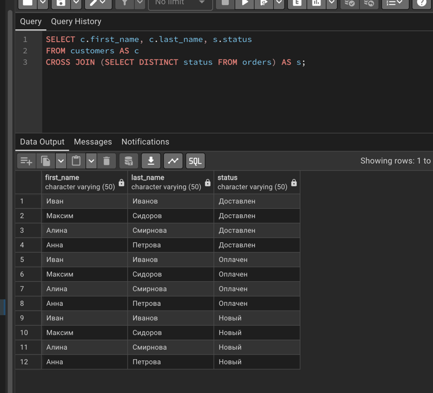


## 18. FULL OUTER JOIN

### 18.1. Вывести все категории и книги, сохраняя несовпадающие строки с обеих сторон.

```sql
SELECT c.name AS category_name, b.title
FROM categories AS c
FULL OUTER JOIN books AS b ON b.category_id = c.id;
```

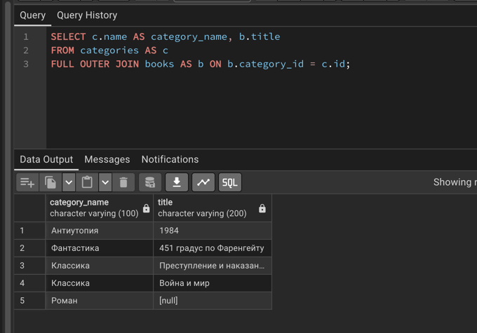


### 18.2. Вывести всех клиентов и все заказы, даже если соответствия нет.

```sql
SELECT c.first_name, c.last_name, o.id AS order_id
FROM customers AS c
FULL OUTER JOIN orders AS o ON o.customer_id = c.id;
```

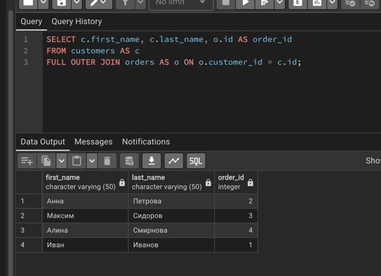


## 19. Соединение нескольких таблиц

### 19.1. Вывести клиентов и названия купленных ими книг.

```sql
SELECT c.first_name, c.last_name, b.title
FROM customers AS c
INNER JOIN orders AS o ON o.customer_id = c.id
INNER JOIN order_items AS oi ON oi.order_id = o.id
INNER JOIN books AS b ON b.id = oi.book_id;
```

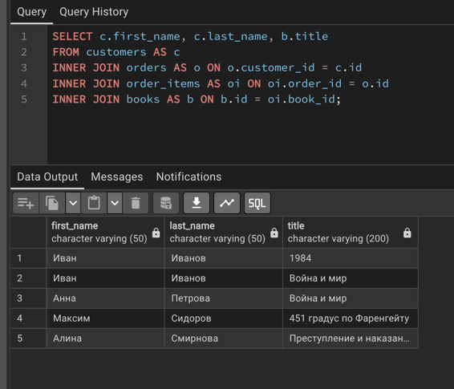


### 19.2. Вывести названия книг, авторов и категории.

```sql
SELECT b.title, a.first_name, a.last_name, c.name AS category_name
FROM books AS b
INNER JOIN authors AS a ON a.id = b.author_id
INNER JOIN categories AS c ON c.id = b.category_id;
```

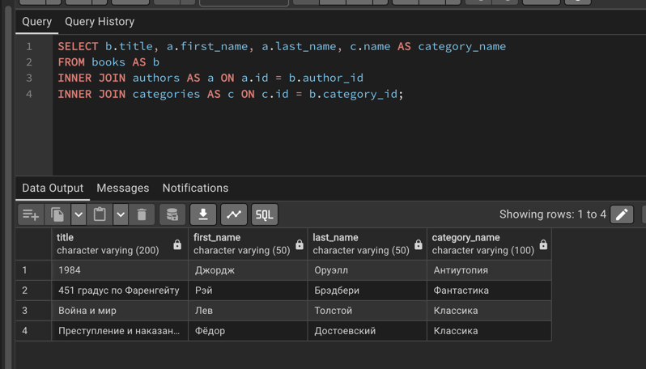
