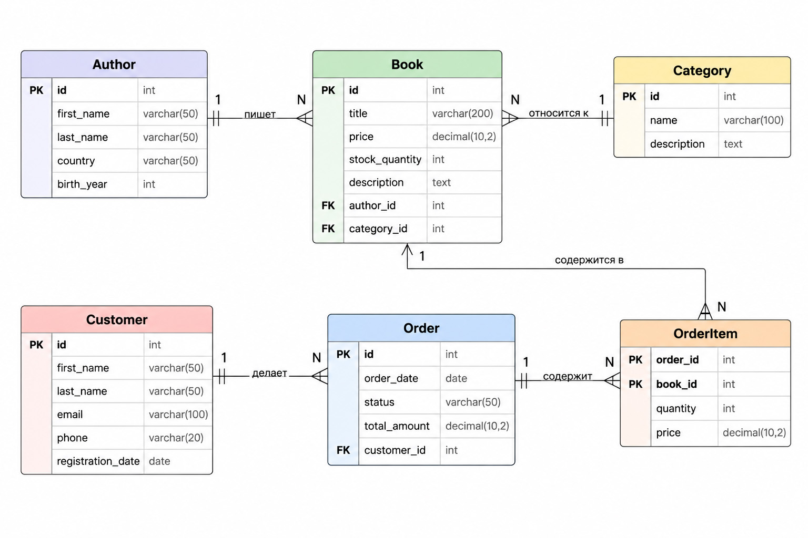

# BookStore DB

## Название проекта

База данных интернет-магазина книг.

## Краткое описание

Данный проект представляет собой базу данных интернет-магазина книг.
Предметная область включает управление каталогом книг, информацией об авторах
и категориях, а также работу с клиентами и их заказами.

База данных позволяет автоматизировать хранение информации о товарах,
отслеживать наличие книг, историю покупок клиентов и структуру заказов.
Использование единой системы хранения уменьшает дублирование данных и упрощает
управление ассортиментом магазина.

## Основные сущности

В базе данных используются следующие сущности:

### Customer (Клиент)
Хранит информацию о покупателях интернет-магазина:
- ID клиента;
- имя;
- email;
- телефон.

### Book (Книга)
Содержит информацию о товарах магазина:
- ID книги;
- название;
- цена;
- количество на складе;
- автор;
- категория.

### Author (Автор)
Хранит данные об авторах книг:
- ID автора;
- имя;
- фамилия;
- страна.

### Category (Категория)
Используется для классификации книг:
- ID категории;
- название;
- описание.

### Order (Заказ)
Хранит информацию о заказах клиентов:
- ID заказа;
- дата заказа;
- статус;
- клиент.

### OrderItem (Позиция заказа)
Представляет книги, входящие в конкретный заказ:
- ID заказа;
- ID книги;
- количество;
- цена покупки.

## ER-диаграмма

